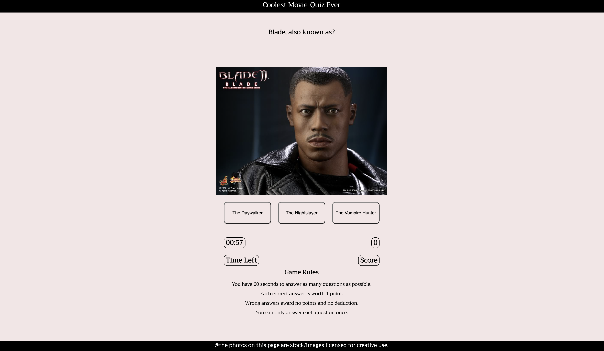
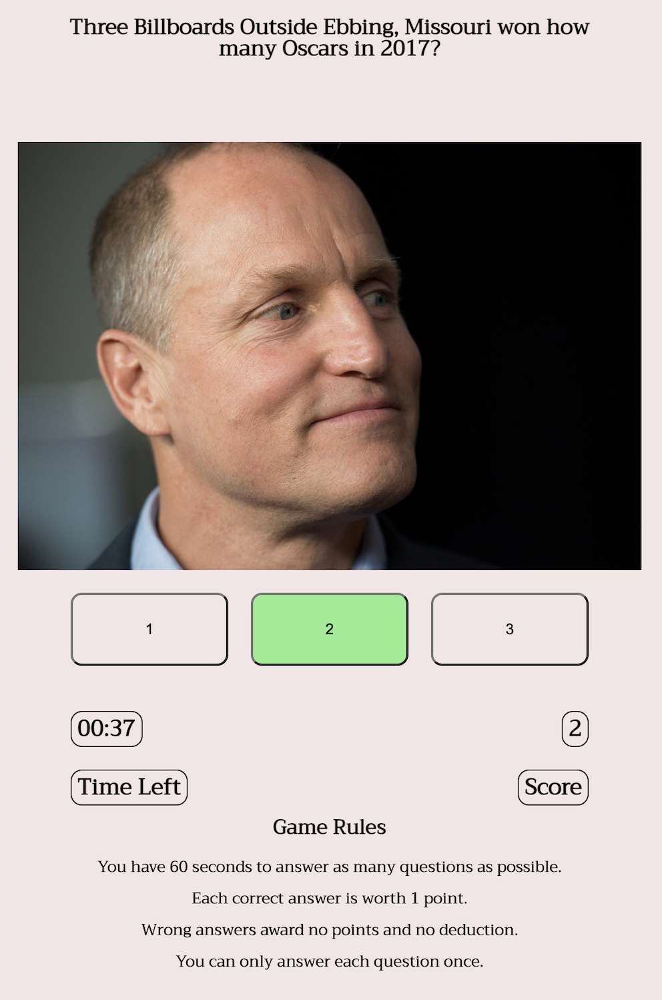
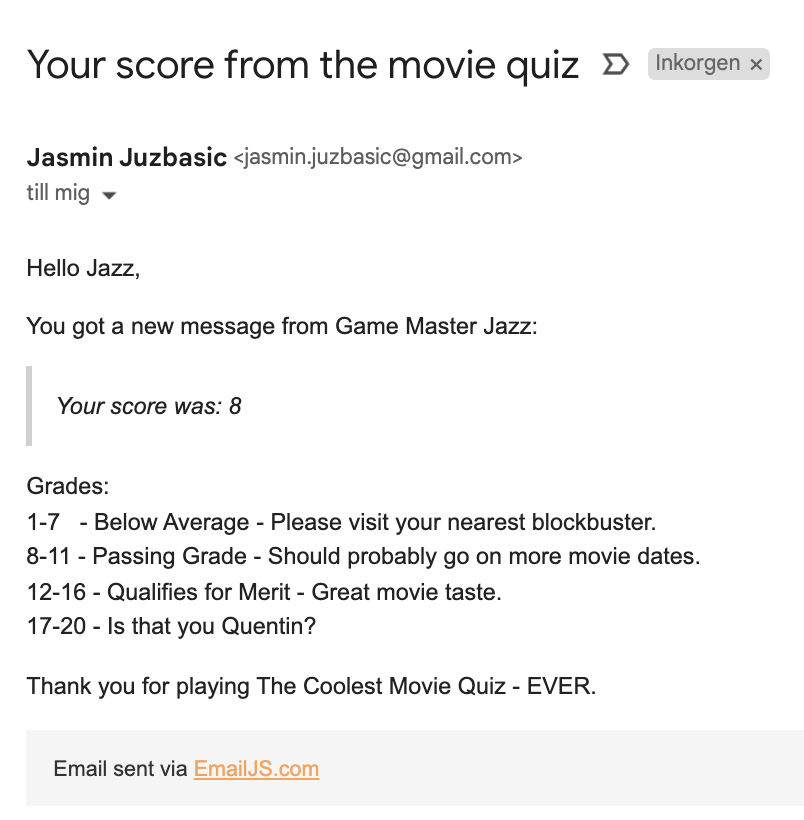

# The Coolest Movie Quiz

- **The Coolest Movie Quiz** is an interactive quiz-game that lets the player answer questions about 20 movies (or until timer runs out). They are presented with a relating image for each question, and have the possbility of choosing one out of three answers. The pace of the game is very high, since your running against the clock, and the player is presented with new questions as soon as a button is pressed. 
- The goal of this movie quiz is of course, to have fun and collect points. However, I wanted to present a real challenge, because most movie-quizes out there are quite easy.
  - The quiz covers many different genres, from comedy, to horror, fantasy classics and some "cult-classics" as well. 
  - The questions are structured in a way that is unpredictable. Sometimes short statements are questions, other times text is quite long, and occasionally it's more related to movie success like the Oscars rather than about the movie itself. 
- The game is played straight away on the landing page, and there are no external links. 
- When the game is finished, players will receive a popup that displays their final score, and the ability to enter their name, and e-mail adress in order to receive their score there.

 

## Features
---
### The Game Area

- Below the header at the top, is the question. After that is you can see the image, and below it are three buttons. 
  - These three elements work in conjunction with eachother. The three buttons have an event listener that triggers that triggers when pressed.
  - It triggers a new question, a new image and new answers. The buttons change color if your answer was correct/wrong, and score is then added to the score-counter. 
- The timer counts down from 1 minute in seconds, and triggers a "game over" popup if it reaches 0. 
- The score increases for every right answer and will later be shown in the popup. 
- On the bottom of the page are the game rules. These can be read before the game starts whilst the alert is kept. 

 

### The Popup

- This popup triggers with an event listener and the main goal of it is to present score, collect player name and their e-mail adress.
  - The score is then sent to their e-mail where they are greeted with a message, a grading-scale and a 'thank you for playing'. 
  - The form uses the inserted name to make the e-mail a bit more personalized. 
- If the player fills in the form incorrectly (name, email) it will trigger an alert, asking them to please do so, sending them back to the form.
  - If fields are filled correcly, it triggers a different alert, saying thank you for submitting and that triggers a window.onload that refreshes the page, which means the game restarts. 

 

 

## Testing
---
- I conducted a test in Firefox and it was fully funcitonal. The button styling looks a little different, but not much. And I think that the game actually runs better in FireFox because the page is loading everything first. Will elaborate on this in the Bugs-section. 
- When testing in Safari the functionality was good, but just like on Chrome, sometimes the page doesen't load before the alert. Buttons looked the same as they did on FireFox. 
- Chrome has been the main browser whilst creating this game, where additional testing has been done.
  - Tested if all answers were correct. 
  - Tested if there was a way to cheat the input form. 
  - Also tested rushing the game and spam-clicking buttons. 
    - During the development process, I did this a few times and it returned an error, I planned on finding it to add as a screen shot but it was something which I couldn't replicate again.
- Confirmed that the site is responsive and works on all different screensizes ranging from 320 pixels to 1200 pixels and above. This includes the pop-up. 
- Confirmed that text is readable, buttons usable, and images are visible. 
- Confirmed that the form works, and triggers the correct alert. 

## Bugs
---
### Solved Bugs

- Difficulty getting images to be responsive, this was solved with adding several media queries that make the image smaller.

- In the beginning, when clicking buttons they would change color, and the next question would show. However, the color then stayed on that button for the rest of the game, and eventually all buttons would carry colors from previous questions. 
  - This was solved by delaying the loop using 'Promise' 'Resolve' 'Async 'Await', and adding it to the event listener. After the 'answer-button-color' there is a small delay, and then the function clear the colors using button.style. 

- During the process I learned about timers, and how tricky they can be to set-up. I have learned that there are a few different ways to set up a timer, but some of them sometimes only counted up, minutes, wouldn't work at all, or they wouldn't trigger on if-else-statements. 
  - I settled with the one I have and I will cover more about it in the Bugs section. 

- In my first meeting with my mentor when I presented the wireframe for the project, he added that it would be nice that if by the end, and time was plenty, I should make the scores be sent there. 
  - Upon writing code and researching I learned that it wasn't possible to do so with only javascript. I finished the function and awaited my final meeting where he showed me emailJS. 
  - There were some problems configuring names with id's in emailJS at first, and after that I received errors in the console. This was because I had added the function to the event listener for the "game-buttons" (making it work like a submit button) thinking that it was alright. 
  - In the end I gave the submit-form-button it's own event listener and errors stopped. 

## Validator Testing
---
### HTML

- No errors when testing with official W3C HTML Validator.

### CSS
- No errors when testing with official W3C (Jigsaw) CSS Validator.

### Accessibility
- Confirmed that fonts and colors are readable and site is accessisble through Lighthouse in DevTools. 

 

### Unfixed Bugs

- Due to the height of the sticky menu, the links in the navbar are actually linked a few rows above the section. 
  - This also means that when you click The Peptalk in the sticky-menu, you wont be able to see the header unless you scroll. 
  - This could have been solved by giving the Peptalk section-header more height, but I felt like there would be too many colors, and too much space between. 

- To make the logo be on it's own row using CSS Grid, I gave the block a width of 100%. Visually this has no implications, however you are able to click the "invisible" index.html link to the right and left of it. 

## Deployment

- The Site was deployed to the GitHub pages. The steps to deploy are as follows:
  - In the GitHub repository navigate yourself to the Settings tab.
  - From the source section drop-down menu, select the Main branch. 
  - Once the main branch has been selected, the page provided the link to the completed website. 
  
- The live link could be found here: [The Workout Plan](https://j-a-s-m-i-n-j.github.io/the-workout-plan/).

## Credits
---
### Content

- For the footer I was inspired by the code that we used for the [Love Running](https://github.com/J-A-S-M-I-N-J/Love-Running-Walkthrough-Jasmin) project.

- The Form from [Love Running](https://github.com/J-A-S-M-I-N-J/Love-Running-Walkthrough-Jasmin) was used as a base and later edited. 

### Guides & Troubleshooting

### CSS Grid
- [W3Schools](https://www.w3schools.com/css/css_rwd_grid.asp) 

### Flexbox

- [Youtube](https://www.youtube.com/watch?v=9e-lWQdO-DA) 
- [CSS-Tricks](https://css-tricks.com/snippets/css/a-guide-to-flexbox/) 
- [W3Schools](https://www.w3schools.com/css/css3_flexbox_container.asp) 

### Sticky Header

- [Stack Overflow](https://stackoverflow.com/questions/55739582/how-to-create-a-fixed-sticky-header-on-scroll-with-html-and-css-only)
- [Codepen](https://codepen.io/phajek/pen/BbeqLG)
- [CSS Deck](https://cssdeck.com/blog/how-to-make-a-sticky-header-step-by-step/) 

### Media Queries  

- [W3Schools](https://www.w3schools.com/css/css_rwd_mediaqueries.asp)

## Media

- Videos in the Guide section are from Youtube.
- In the same order as the web-page (top to bottom).
- [Youtube](https://www.youtube.com/embed/wTToRXhF6RU)
- [Youtube](https://www.youtube.com/embed/0Q8fETMjWqQ)
- [Youtube](https://www.youtube.com/embed/xdRtqKr8yKI)
- [Youtube](https://www.youtube.com/embed/3upx6bSFTSE)
