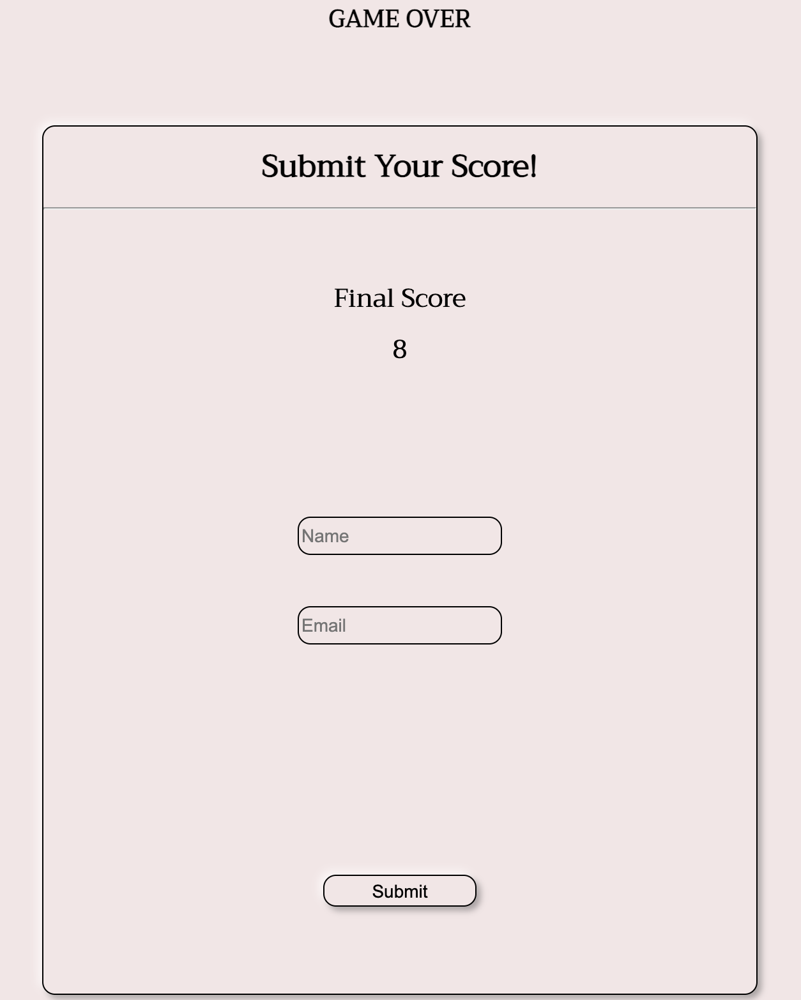
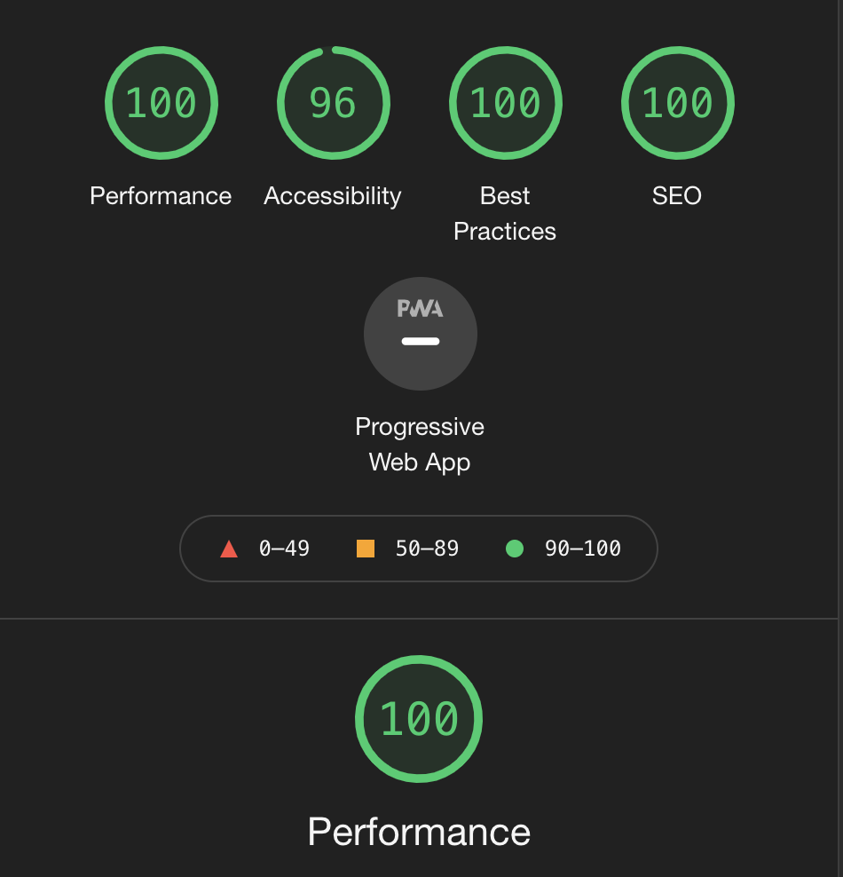

# Coolest Movie Quiz

- **Coolest Movie Quiz** is an interactive quiz-game that lets the player answer questions about 20 movies (or until timer runs out). They are presented with a relating image for each question, and have the possbility of choosing one out of three answers. The pace of the game is very high, since your running against the clock, and the player is presented with new questions as soon as a button is pressed. 
- The goal of this movie quiz is of course, to have fun and collect points. However, I wanted to present a real challenge, because most movie-quizes out there are quite easy.
  - The quiz covers many different genres, from comedy, to horror, fantasy classics and some "cult-classics" as well. 
  - The questions are structured in a way that is unpredictable. Sometimes short statements are questions, other times text is quite long, and occasionally it's more related to movie success like the Oscars rather than about the movie itself. 
- The game is played straight away on the landing page, and there are no external links. 
- When the game is finished, players will receive a popup that displays their final score, and the ability to enter their name, and e-mail adress in order to receive their score there.

 

## Features
---
### The Game Area

- Below the header at the top, is the question. After that is you can see the image, and below it are three buttons. 
  - These three elements work in conjunction with eachother. The three buttons have an event listener that triggers that triggers when pressed.
  - It triggers a new question, a new image and new answers. The buttons change color if your answer was correct/wrong, and score is then added to the score-counter. 
- The timer counts down from 1 minute in seconds, and triggers a "game over" popup if it reaches 0. 
- The score increases for every right answer and will later be shown in the popup. 
- On the bottom of the page are the game rules. These can be read before the game starts whilst the alert is kept. 

 

### The Popup

- This popup triggers with an event listener and the main goal of it is to present score, collect player name and their e-mail adress.
  - The score is then sent to their e-mail where they are greeted with a message, a grading-scale and a 'thank you for playing'. 
  - The form uses the inserted name to make the e-mail a bit more personalized. 
- If the player fills in the form incorrectly (name, email) it will trigger an alert, asking them to please do so, sending them back to the form.
  - If fields are filled correcly, it triggers a different alert, saying thank you for submitting and that triggers a window.onload that refreshes the page, which means the game restarts. 

 

 

## Testing
---
- I conducted a test in Firefox and it was fully funcitonal. The button styling looks a little different, but not much. And I think that the game actually runs better in FireFox because the page is loading everything first. Will elaborate on this in the Bugs-section. 
- When testing in Safari the functionality was good, but just like on Chrome, sometimes the page doesen't load before the alert. Buttons looked the same as they did on FireFox. 
- Chrome has been the main browser whilst creating this game, where additional testing has been done.
  - Tested if all answers were correct. 
  - Tested if there was a way to cheat the input form. 
  - Also tested rushing the game and spam-clicking buttons. 
    - During the development process, I did this a few times and it returned an error, I planned on finding it to add as a screen shot but it was something I couldn't replicate again.
- Confirmed that the site is responsive and works on all different screensizes ranging from 320 pixels to 1200 pixels and above. This includes the pop-up. 
- Confirmed that text is readable, buttons usable, and images are visible. 
- Confirmed that the form works, and triggers the correct alert. 

 

## Bugs
---
### Solved Bugs

- Difficulty getting images to be responsive, this was solved with adding several media queries that make the image smaller.

- In the beginning, when clicking buttons they would change color, and the next question would show. However, the color then stayed on that button for the rest of the game, and eventually all buttons would carry colors from previous questions. 
  - This was solved by delaying the loop using 'Promise' 'Resolve' 'Async 'Await', and adding it to the event listener. After the 'answer-button-color' there is a small delay, and then the function clear the colors using button.style. 

- During the process I learned about timers, and how tricky they can be to set-up. I have learned that there are a few different ways to set up a timer, but some of them sometimes only counted up, minutes, wouldn't work at all, or they wouldn't trigger on if-else-statements. 
  - I settled with the one I have and I will cover more about it in the Bugs section. 

- In my first meeting with my mentor when I presented the wireframe for the project, he added that it would be nice that if by the end, and time was plenty, I should make the scores be sent there. 
  - Upon writing code and researching I learned that it wasn't possible to do so with only javascript. I finished the function and awaited my final meeting where he showed me emailJS. 
  - There were some problems configuring names with id's in emailJS at first, and after that I received errors in the console. This was because I had added the function to the event listener for the "game-buttons" (making it work like a submit button) thinking that it was alright. 
  - In the end I gave the submit-form-button it's own event listener and errors stopped. 

## Validator Testing
---
### HTML

- Few errors that have been fixed with official W3C HTML Validator.

### CSS

- Recieved some typing errors that have been fixed. Validated with W3C (Jigsaw) CSS Validator.

### JSHint

- Received comment: "Functions declared within loops referencing an outer scoped variable may lead to confusing semantics. (isCorrectAnswer, currentQuestion, answerButton, correctAnswerHandler, timeFunction, getNextQuestion, showQuestion, showPopup)". 
  - They are all working as intended though. 

- There are 4 undefined variables: minutes, seconds, Promise, emailjs - but their functions work properly. 

- No console errors are triggering.

### Accessibility
- Confirmed that fonts and colors are readable and site is accessisble through Lighthouse in DevTools. 

 

### Unfixed Bugs

- The e-mail validation is not working properly. If fields are empty the alert is triggered, however inserting anything in both fields submits successfully.
  - This is strange because in the HTML, type=email and it also has a required input. 
  - In the email-function in JS there is also a if statement: if (emailAdress !== "" && playerName !== "") ... it should return an error. 
  - I attempted doing some damage control as things stand by adding minlength and maxlength so players wouldn't just add random inputs leave the site, however, this is also not working. 

- The timer actually starts at waits 1 second without "moving", then goes to 00:00 - then goes up to 01.00 before counting down, which means players actually get about 63 seconds to play the game. 

- As things stand now, the timer doesen't end the game at all. This broke when fixing something else, and I haven't been able to restore it, afraid to break something else. 

- There is a minor inconvenience at the start of the game: About half of the times on Safari / Chrome the alert triggers before the page has been loaded in the back. 
  - The idea is that while you read the alert, and recieve further instructions to look at the bottom (to read rules), it actually wont load fast enough. 
  - Players then have to press OK - start the game, read the rules at the bottom, and then refresh page to get back the time lost. This solution is presented in the alert. 
  - FireFox does not have this issue. 

- Not really a bug, more of a disclaimer: I intended to use real snapshots / images for many of the movies, however I do not have rights for any good ones. 
  - All photos used are licensed for "creative" use, however many photos are of lower quality and not being able to find the right sizes has impacted the overall style. 

## Deployment

- The Site was deployed to the GitHub pages. The steps to deploy are as follows:
  - In the GitHub repository navigate yourself to the Settings tab.
  - From the source section drop-down menu, select the Main branch. 
  - Once the main branch has been selected, the page provided the link to the completed website. 
  
- The live link could be found here: [Coolest Movie Quiz](https://j-a-s-m-i-n-j.github.io/the-workout-plan/).

## Credits
---
### Content

- During Love Math we got to learned how to increment for keeping scores and check answers.
- [Love Math](https://j-a-s-m-i-n-j.github.io/love-maths-jasmin/)

### Guides & Troubleshooting

### Promise, Resolve, Async, Await
- [Geeksforgeeks](https://www.geeksforgeeks.org/how-to-delay-a-loop-in-javascript-using-async-await-with-promise/) 

### EmailJS

- [EmailJS](https://www.emailjs.com/) 

### Window.Onload  

- [Geeksforgeeks](https://www.geeksforgeeks.org/how-to-run-a-function-when-the-page-is-loaded-in-javascript/)
- [Stack Overflow](https://stackoverflow.com/questions/5721704/window-location-reload-with-clear-cache)

### Hiding & Styling a Popup

- [Formget](https://www.formget.com/how-to-create-pop-up-contact-form-using-javascript/)

### Template for Array

- [Simplestepcode](https://simplestepscode.com/javascript-quiz-tutorial/#step2)

